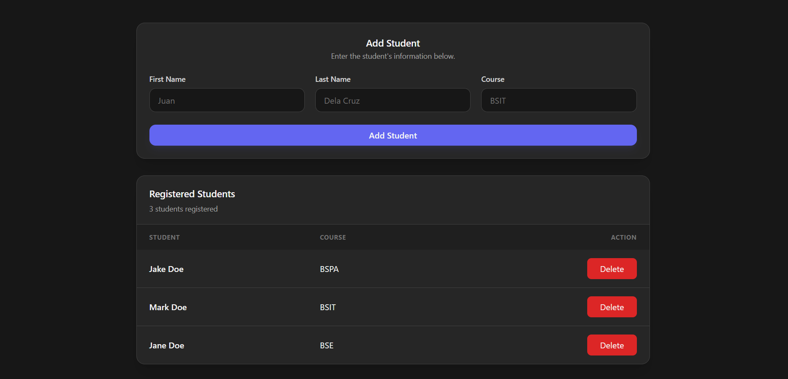

# Django Quiz 3 Hands On
**Read the `LICENSE.md` FIRST BEFORE ANYTHING (*You cannot copy this code for academic purpose, otherwise there would be legal consequences!*)**

### Preview


### Prerequisites:
1. Python (with pip installer)

### Setup:
1. Generate a safe key using this command in your python interpreter:
    ```python
    from django.core.management.utils import get_random_secret_key
    print(get_random_secret_key())
    ```
2. Create an `.env` file that contains:
    ```env
    DJANGO_ENV=development
    DJANGO_SECRET_KEY=[Generated-Key-Here...]
    DEBUG=True
    ALLOWED_HOSTS=127.0.0.1, localhost
    ```
    *Note: Replace django secret key with your actual python-generated key and allowed hosts on where you want to host your program.*
3. Create your virtual environment by running `python -m venv venv`.
4. Activate your virtual environment with `.\venv\Scripts\activate` (for Windows).
5. Install all the necessary dependencies with `pip install -r requirements.txt`
6. Run `python manage.py migrate` (if using database) for database migration.
7. Run the server via `python manage.py runserver`. 
    *(Note: If existing port is used, used another port, example: `python manage.py runserver 7000`, `7000` is the port to run the server.)*

---

### Additional Notes:
- If database is modified from the previous schema, always run `python manage.py makemigrations` then `python manage.py migrate`.
- If installing additional dependencies, run `pip freeze > requirements.txt`.
- Always set `DEBUG=False` on production.

### Dependencies
- All package dependencies are in `requirements.txt` file.